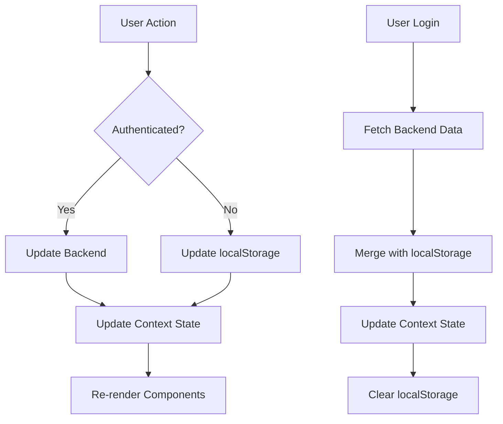

# Design Document

## Overview

This design addresses critical bugs and enhancements for the Next.js + Strapi e-commerce application. The system currently suffers from missing wishlist functionality, incomplete checkout displays, order persistence failures, and authentication issues. This design provides comprehensive solutions for all identified problems while adding new features to improve user experience.

The design follows a modular architecture with clear separation between frontend state management, API communication, and backend data persistence. Key improvements include:

- **Wishlist System**: New context provider with localStorage and backend synchronization
- **Enhanced Checkout**: Complete product information display with proper image handling
- **Order Persistence**: Fixed API integration with proper authentication token handling
- **Authentication Fixes**: Corrected signup/login flows with proper error handling
- **New Pages**: About, Contact, FAQ, User Profile, Order History, and policy pages
- **Admin Security**: Protected admin panel with hardcoded credential authentication
- **UI/UX Improvements**: Consistent styling, loading states, and user feedback

## Architecture

### Frontend Architecture

```
frontend/
├── app/
│   ├── context/
│   │   ├── CartContext.js (existing - enhanced)
│   │   └── WishlistContext.js (new)
│   ├── checkout/
│   │   └── page.js (fix order persistence)
│   ├── auth/
│   │   ├── signin/page.js (fix authentication)
│   │   ├── signup/page.js (fix registration)
│   │   └── admin-login/page.js (new)
│   ├── admin/
│   │   ├── page.js (add authentication protection)
│   │   └── middleware.js (new - admin auth check)
│   ├── profile/
│   │   └── page.js (new)
│   ├── orders/
│   │   └── page.js (new - order history)
│   ├── about/page.js (new)
│   ├── contact/page.js (new)
│   ├── faq/page.js (new)
│   ├── privacy/page.js (new)
│   ├── terms/page.js (new)
│   ├── shipping/page.js (new)
│   └── components/
│       ├── OrderSummary.jsx (fix display issues)
│       ├── WishlistButton.jsx (new)
│       ├── WishlistDrawer.jsx (new)
│       ├── Notification.jsx (new)
│       └── LoadingSpinner.jsx (new)
├── lib/
│   ├── orders.js (fix authentication)
│   ├── wishlist.js (new)
│   └── admin-auth.js (new)
└── hooks/
    └── useNotification.js (new)
```

### Backend Architecture

```
backend/
└── src/
    └── api/
        ├── order/
        │   └── content-types/
        │       └── order/
        │           └── schema.json (fix typo: orde_status → order_status)
        └── wishlist/
            └── content-types/
                └── wishlist/
                    └── schema.json (new)
```

### State Management Flow



## Components and Interfaces

### 1. Wishlist Context

**Purpose**: Manage wishlist state and operations with backend synchronization

**Interface**:
```typescript
interface WishlistContextValue {
  wishlist: WishlistItem[];
  addToWishlist: (product: Product) => Promise<void>;
  removeFromWishlist: (productId: number) => Promise<void>;
  moveToCart: (productId: number, size: string) => Promise<void>;
  clearWishlist: () => Promise<void>;
  isInWishlist: (productId: number) => boolean;
  totalItems: number;
  isOpen: boolean;
  setIsOpen: (open: boolean) => void;
}

interface WishlistItem {
  id: number;
  productId: number;
  name: string;
  price: number;
  image: string;
  availableSizes: string[];
  addedAt: string;
}
```

**Implementation Details**:
- Use React Context API for state management
- Store wishlist in localStorage for unauthenticated users
- Sync with backend API for authenticated users
- Merge localStorage wishlist with backend on login
- Provide optimistic updates with error rollback

### 2. Enhanced Cart Context

**Purpose**: Fix existing cart context to properly handle product data

**Changes**:
```typescript
// Fix: Ensure all product attributes are properly extracted
const addToCart = (product, quantity = 1, size = 'M') => {
  const price = Number(product.attributes?.price || product.price);
  const name = product.attributes?.name || product.name;
  const image = product.attributes?.image?.data?.attributes?.url || product.image;
  
  // ... rest of implementation
};
```

### 3. Order Summary Component

**Purpose**: Display complete order information in checkout

**Enhanced Interface**:
```typescript
interface OrderSummaryProps {
  showImages?: boolean;
  showSizes?: boolean;
  showIndividualPrices?: boolean;
}

interface DisplayItem {
  id: number;
  name: string;
  price: number;
  size: string;
  quantity: number;
  image: string;
  lineTotal: number;
}
```

**Implementation Details**:
- Display product images using Next.js Image component
- Show size for each cart item
- Display individual unit price and line total
- Handle missing images with placeholder
- Calculate and display subtotal, shipping, tax, and grand total
- Use proper image URL construction: `${BACKEND_URL}${imagePath}`

### 4. Order Persistence

**Purpose**: Fix order saving to Strapi backend

**API Interface**:
```typescript
interface OrderData {
  orderNumber: string;
  customer: CustomerInfo;
  items: OrderItem[];
  subtotal: number;
  shipping: number;
  tax: number;
  total: number;
  paymentMethod: string;
  order_status: 'pending' | 'processing' | 'shipped' | 'delivered' | 'cancelled';
}

interface OrderItem {
  productId: number;
  name: string;
  price: number;
  size: string;
  quantity: number;
  image: string;
}

interface CustomerInfo {
  firstName: string;
  lastName: string;
  email: string;
  phone: string;
  address: string;
  city: string;
  postalCode: string;
  country: string;
}
```

**Implementation Details**:
- Include JWT token in Authorization header
- Send properly formatted data matching Strapi schema
- Handle API errors with user-friendly messages
- Clear cart only after successful order creation
- Redirect to confirmation page with order ID
- Keep localStorage backup for admin dashboard

### 5. Authentication System

**Purpose**: Fix signup and login functionality

**Signup Flow**:
```typescript
async function handleSignup(credentials: SignupCredentials): Promise<AuthResult> {
  // 1. Validate input (email format, password length)
  // 2. Call Strapi registration endpoint
  // 3. Handle duplicate email error
  // 4. Redirect to login on success
}
```

**Login Flow**:
```typescript
async function handleLogin(credentials: LoginCredentials): Promise<AuthResult> {
  // 1. Validate input
  // 2. Call NextAuth signIn with credentials provider
  // 3. Store JWT token in session
  // 4. Merge wishlist from localStorage
  // 5. Redirect to home or callback URL
}
```

**Error Handling**:
- Display specific error messages for common issues
- Handle network errors gracefully
- Prevent form resubmission during processing
- Clear sensitive data on error

### 6. Admin Authentication

**Purpose**: Protect admin panel with hardcoded credentials

**Interface**:
```typescript
interface AdminCredentials {
  username: string;
  password: string;
}

interface AdminSession {
  isAdmin: boolean;
  username: string;
  loginTime: string;
}
```

**Implementation Details**:
- Create separate admin login page at `/auth/admin-login`
- Store admin session in sessionStorage (not localStorage)
- Check admin session on admin page mount
- Redirect to admin login if not authenticated
- Hardcoded credentials: username="admin", password="admin123secure"
- Add logout button in admin dashboard header
- Clear admin session on logout

### 7. New Pages

#### User Profile Page

**Purpose**: Allow users to view and edit their profile information

**Interface**:
```typescript
interface UserProfile {
  id: number;
  username: string;
  email: string;
  firstName: string;
  lastName: string;
  phone: string;
  addresses: Address[];
}

interface Address {
  id: number;
  label: string; // "Home", "Work", etc.
  address: string;
  city: string;
  postalCode: string;
  country: string;
  isDefault: boolean;
}
```

#### Order History Page

**Purpose**: Display user's past orders

**Interface**:
```typescript
interface OrderHistoryItem {
  id: number;
  orderNumber: string;
  date: string;
  total: number;
  order_status: string;
  itemCount: number;
}

interface OrderDetail extends OrderHistoryItem {
  items: OrderItem[];
  customer: CustomerInfo;
  trackingNumber?: string;
  subtotal: number;
  shipping: number;
  tax: number;
}
```

#### Contact Page

**Purpose**: Allow users to send messages to store

**Interface**:
```typescript
interface ContactForm {
  name: string;
  email: string;
  subject: string;
  message: string;
}
```

**Implementation**: Use email service (e.g., SendGrid, Nodemailer) or save to Strapi

#### Static Pages

- **About Page**: Store information, mission, team
- **FAQ Page**: Accordion-style Q&A
- **Privacy Policy**: Data collection and usage
- **Terms of Service**: Legal terms and conditions
- **Shipping & Returns**: Shipping rates, delivery times, return policy

### 8. UI/UX Components

#### Notification System

**Purpose**: Provide user feedback for actions

**Interface**:
```typescript
interface Notification {
  id: string;
  type: 'success' | 'error' | 'info' | 'warning';
  message: string;
  duration?: number;
}

interface NotificationContextValue {
  notifications: Notification[];
  showNotification: (type: string, message: string, duration?: number) => void;
  removeNotification: (id: string) => void;
}
```

**Implementation**:
- Toast-style notifications in top-right corner
- Auto-dismiss after duration (default 3 seconds)
- Stack multiple notifications
- Smooth enter/exit animations

#### Loading States

**Purpose**: Indicate asynchronous operations

**Components**:
- `LoadingSpinner`: Full-page or inline spinner
- `ButtonLoading`: Button with loading state
- `SkeletonLoader`: Placeholder for content loading

## Data Models

### Wishlist Schema (Strapi)

```json
{
  "kind": "collectionType",
  "collectionName": "wishlists",
  "info": {
    "singularName": "wishlist",
    "pluralName": "wishlists",
    "displayName": "Wishlist"
  },
  "options": {
    "draftAndPublish": false
  },
  "attributes": {
    "user": {
      "type": "relation",
      "relation": "manyToOne",
      "target": "plugin::users-permissions.user",
      "inversedBy": "wishlists"
    },
    "product": {
      "type": "relation",
      "relation": "manyToOne",
      "target": "api::product.product"
    },
    "addedAt": {
      "type": "datetime",
      "default": "now"
    }
  }
}
```

### Fixed Order Schema (Strapi)

**Changes**:
- Rename `orde_status` to `order_status`
- Fix enum format (remove quotes around comma-separated values)
- Add customer information fields

```json
{
  "kind": "collectionType",
  "collectionName": "orders",
  "info": {
    "singularName": "order",
    "pluralName": "orders",
    "displayName": "Order"
  },
  "options": {
    "draftAndPublish": true
  },
  "attributes": {
    "orderNumber": {
      "type": "string",
      "required": true,
      "unique": true
    },
    "user": {
      "type": "relation",
      "relation": "manyToOne",
      "target": "plugin::users-permissions.user",
      "inversedBy": "orders"
    },
    "items": {
      "type": "json",
      "required": true
    },
    "customer": {
      "type": "json",
      "required": true
    },
    "subtotal": {
      "type": "decimal",
      "required": true
    },
    "shipping": {
      "type": "decimal",
      "required": true
    },
    "tax": {
      "type": "decimal",
      "required": true
    },
    "total": {
      "type": "decimal",
      "required": true
    },
    "order_status": {
      "type": "enumeration",
      "enum": ["pending", "processing", "shipped", "delivered", "cancelled"],
      "default": "pending",
      "required": true
    },
    "paymentMethod": {
      "type": "string",
      "required": true
    },
    "trackingNumber": {
      "type": "string"
    },
    "notes": {
      "type": "text"
    }
  }
}
```

### User Profile Extension (Strapi)

**Add to existing user model**:
```json
{
  "attributes": {
    "firstName": {
      "type": "string"
    },
    "lastName": {
      "type": "string"
    },
    "phone": {
      "type": "string"
    },
    "addresses": {
      "type": "json"
    },
    "orders": {
      "type": "relation",
      "relation": "oneToMany",
      "target": "api::order.order",
      "mappedBy": "user"
    },
    "wishlists": {
      "type": "relation",
      "relation": "oneToMany",
      "target": "api::wishlist.wishlist",
      "mappedBy": "user"
    }
  }
}
```

## Correctness Properties

*A property is a characteristic or behavior that should hold true across all valid executions of a system—essentially, a formal statement about what the system should do. Properties serve as the bridge between human-readable specifications and machine-verifiable correctness guarantees.*


### Property Reflection

After analyzing all acceptance criteria, I've identified the following redundancies:

**Redundant Properties:**
- 3.10 and 5.3 both test that new orders have status "pending" - combine into one property
- 2.4 and 10.1 both test that product images are displayed in checkout - combine into one property
- 2.5 and 10.3 both test placeholder images for missing images - combine into one property
- 2.3, 2.7, 2.8, 2.9, 2.10 all test order calculations - can be combined into comprehensive calculation properties

**Combined Properties:**
- Order calculation properties (2.3, 2.7, 2.8, 2.9, 2.10) → Combine into "Order totals calculation correctness"
- Order data completeness (3.3, 3.4, 3.5, 3.6) → Combine into "Order data completeness"

**Properties to Keep Separate:**
- Wishlist operations (add, remove, move to cart) - each tests different behavior
- Authentication flows (signup, login, logout) - each tests different flow
- Display requirements - each tests different UI elements

### Correctness Properties

**Property 1: Wishlist addition**
*For any* product, when added to the wishlist, the product should appear in the wishlist with correct product ID, name, price, and image
**Validates: Requirements 1.2**

**Property 2: Wishlist display completeness**
*For any* wishlist, the rendered output should contain all required fields (image, name, price, available sizes) for each wishlist item
**Validates: Requirements 1.3**

**Property 3: Wishlist removal**
*For any* wishlist item, when removed from the wishlist, the item should no longer appear in the wishlist
**Validates: Requirements 1.4**

**Property 4: Wishlist to cart transfer**
*For any* wishlist item with a selected size, when moved to cart, the item should appear in the cart with the correct size and should be removed from the wishlist
**Validates: Requirements 1.5**

**Property 5: Authenticated wishlist persistence**
*For any* authenticated user, when a product is added to the wishlist, the backend should contain that wishlist item
**Validates: Requirements 1.6**

**Property 6: Unauthenticated wishlist storage**
*For any* unauthenticated user, when a product is added to the wishlist, localStorage should contain that wishlist item
**Validates: Requirements 1.7**

**Property 7: Wishlist merge on login**
*For any* user with wishlist items in both localStorage and backend, after login, the combined wishlist should contain all unique items from both sources
**Validates: Requirements 1.8**

**Property 8: Order summary display completeness**
*For any* cart item in the order summary, the rendered output should contain size, unit price, line total, and image
**Validates: Requirements 2.1, 2.2, 2.3, 2.4, 10.1**

**Property 9: Line total calculation**
*For any* cart item, the line total should equal unit price multiplied by quantity
**Validates: Requirements 2.3**

**Property 10: Order totals calculation correctness**
*For any* cart, the following should hold:
- Subtotal = sum of all line totals
- Shipping = $10 if subtotal < $100, else $0
- Tax = subtotal × 0.1
- Total = subtotal + shipping + tax
**Validates: Requirements 2.6, 2.7, 2.8, 2.9, 2.10**

**Property 11: Order persistence to backend**
*For any* completed checkout, the backend should contain an order record with matching order data
**Validates: Requirements 3.1**

**Property 12: Order API authentication**
*For any* order creation request, the Authorization header should contain a valid JWT token
**Validates: Requirements 3.2, 4.7**

**Property 13: Order data completeness**
*For any* saved order, the order should contain all required fields: items (with productId, name, price, size, quantity, image), customer info (firstName, lastName, email, phone, address, city, postalCode, country), totals (subtotal, shipping, tax, total), paymentMethod, and timestamp
**Validates: Requirements 3.3, 3.4, 3.5, 3.6**

**Property 14: Order save error handling**
*For any* failed order save operation, an error message should be displayed to the user
**Validates: Requirements 3.7**

**Property 15: Order save success behavior**
*For any* successful order save, the cart should be empty and the user should be redirected to the order confirmation page
**Validates: Requirements 3.8**

**Property 16: Order number format**
*For any* generated order number, it should match the pattern "ORD-{timestamp}-{alphanumeric}"
**Validates: Requirements 3.9**

**Property 17: Initial order status**
*For any* newly created order, the order_status should be "pending"
**Validates: Requirements 3.10, 5.3**

**Property 18: User account creation**
*For any* valid signup credentials (unique email, valid format, password ≥ 6 chars), submitting the signup form should create a new user in the backend
**Validates: Requirements 4.1**

**Property 19: Duplicate email rejection**
*For any* signup attempt with an existing email, an error message should be displayed
**Validates: Requirements 4.2**

**Property 20: Successful login session creation**
*For any* valid login credentials, the system should create a session containing a JWT token
**Validates: Requirements 4.3, 4.5**

**Property 21: Invalid login error**
*For any* invalid login credentials, an error message should be displayed
**Validates: Requirements 4.4**

**Property 22: Checkout authentication requirement**
*For any* unauthenticated user attempting to access the checkout page, the system should redirect to the sign-in page
**Validates: Requirements 4.6**

**Property 23: Logout behavior**
*For any* authenticated user, logging out should clear the session and redirect to the home page
**Validates: Requirements 4.8**

**Property 24: Email format validation**
*For any* signup attempt, invalid email formats should be rejected with an error message
**Validates: Requirements 4.9**

**Property 25: Password length validation**
*For any* signup attempt with password < 6 characters, the system should reject it with an error message
**Validates: Requirements 4.10**

**Property 26: Order status enumeration validation**
*For any* order status value, the system should only accept: "pending", "processing", "shipped", "delivered", "cancelled"
**Validates: Requirements 5.2, 5.5**

**Property 27: Order status filtering**
*For any* order status query, the system should return only orders matching that status
**Validates: Requirements 5.4**

**Property 28: Loading indicator display**
*For any* asynchronous operation (form submission, API call), a loading indicator should be displayed during the operation
**Validates: Requirements 6.5, 6.9**

**Property 29: Error message display**
*For any* error condition, an error message should be displayed to the user
**Validates: Requirements 6.6**

**Property 30: Responsive layout**
*For any* viewport size (mobile: 320-767px, tablet: 768-1023px, desktop: 1024px+), the layout should be functional and readable
**Validates: Requirements 6.10**

**Property 31: Contact form submission**
*For any* valid contact form data, submitting the form should send the message to the configured email address
**Validates: Requirements 7.3**

**Property 32: Profile display completeness**
*For any* authenticated user viewing their profile, the display should contain name, email, and all saved addresses
**Validates: Requirements 7.6**

**Property 33: Profile update persistence**
*For any* profile update, the backend should contain the updated user data
**Validates: Requirements 7.7**

**Property 34: Order history display completeness**
*For any* order in the order history, the display should contain orderNumber, date, total, status, and itemCount
**Validates: Requirements 7.9**

**Property 35: Order detail display completeness**
*For any* order detail view, the display should contain all items, shipping address, and tracking number (if available)
**Validates: Requirements 7.10**

**Property 36: Admin dashboard authentication**
*For any* unauthenticated user attempting to access /admin, the system should redirect to the admin login page
**Validates: Requirements 8.1, 8.2**

**Property 37: Admin authentication success**
*For any* correct admin credentials (username="admin", password="admin123secure"), the system should grant access to the admin dashboard
**Validates: Requirements 8.4**

**Property 38: Admin authentication failure**
*For any* incorrect admin credentials, an error message should be displayed
**Validates: Requirements 8.5**

**Property 39: Admin session isolation**
*For any* admin session, it should be stored separately from regular user sessions and not interfere with user authentication
**Validates: Requirements 8.6**

**Property 40: Admin logout behavior**
*For any* admin logout, the admin session should be cleared and the user should be redirected to the admin login page
**Validates: Requirements 8.7**

**Property 41: Regular user admin access prevention**
*For any* regular authenticated user (non-admin), attempting to access /admin should be denied
**Validates: Requirements 8.10**

**Property 42: Cart count badge accuracy**
*For any* cart state, the cart icon badge should display the total quantity of items in the cart
**Validates: Requirements 9.3**

**Property 43: Add to cart notification**
*For any* product added to cart, a success notification should be displayed
**Validates: Requirements 9.4**

**Property 44: Add to wishlist notification**
*For any* product added to wishlist, a success notification should be displayed
**Validates: Requirements 9.5**

**Property 45: Real-time form validation**
*For any* form input with validation rules, invalid input should display an inline error message immediately
**Validates: Requirements 9.8**

**Property 46: Submit button disable during submission**
*For any* form submission in progress, the submit button should be disabled
**Validates: Requirements 9.9**

**Property 47: Search autocomplete**
*For any* search query, the system should display autocomplete suggestions based on product names
**Validates: Requirements 9.10**

**Property 48: Empty search results message**
*For any* search query with no matching products, the system should display "No results found"
**Validates: Requirements 9.11**

**Property 49: Product availability display**
*For any* product, the system should display availability status (In Stock, Out of Stock, or Low Stock)
**Validates: Requirements 9.13**

**Property 50: Image URL construction**
*For any* product image, the image URL should be constructed as `${BACKEND_URL}${imagePath}`
**Validates: Requirements 10.2**

**Property 51: Primary image selection**
*For any* product with multiple images, the order summary should display the primary (first) image
**Validates: Requirements 10.7**

## Error Handling

### Frontend Error Handling

**API Request Errors**:
- Network errors: Display "Network error. Please check your connection."
- 401 Unauthorized: Redirect to login page
- 403 Forbidden: Display "Access denied"
- 404 Not Found: Display "Resource not found"
- 500 Server Error: Display "Server error. Please try again later."
- Timeout: Display "Request timed out. Please try again."

**Form Validation Errors**:
- Display inline error messages below invalid fields
- Prevent form submission until all errors are resolved
- Clear errors when user corrects input
- Show field-specific error messages (e.g., "Email is required", "Password must be at least 6 characters")

**Image Loading Errors**:
- Use placeholder image when image fails to load
- Log error to console for debugging
- Don't block page rendering

**State Management Errors**:
- Implement error boundaries to catch React errors
- Display fallback UI when component errors occur
- Log errors for debugging

### Backend Error Handling

**Authentication Errors**:
- Invalid credentials: Return 401 with message "Invalid email or password"
- Duplicate email: Return 400 with message "Email already exists"
- Missing token: Return 401 with message "Authentication required"
- Invalid token: Return 401 with message "Invalid or expired token"

**Validation Errors**:
- Missing required fields: Return 400 with field-specific messages
- Invalid data format: Return 400 with format requirements
- Enum validation: Return 400 with allowed values

**Database Errors**:
- Connection errors: Return 500 with generic message
- Constraint violations: Return 400 with specific constraint message
- Query errors: Log error and return 500

## Testing Strategy

### Dual Testing Approach

This feature requires both unit tests and property-based tests for comprehensive coverage:

**Unit Tests**: Focus on specific examples, edge cases, and integration points
- Test specific user flows (signup → login → add to cart → checkout)
- Test edge cases (empty cart, missing images, network failures)
- Test error conditions (invalid credentials, duplicate emails, failed API calls)
- Test component rendering with specific props
- Test integration between components

**Property-Based Tests**: Verify universal properties across all inputs
- Test calculation properties with random cart data
- Test data completeness with random order data
- Test validation rules with random input
- Test state management with random operations
- Minimum 100 iterations per property test

### Property-Based Testing Configuration

**Library Selection**: Use `fast-check` for JavaScript/TypeScript property-based testing

**Test Configuration**:
```javascript
import fc from 'fast-check';

// Example property test
describe('Feature: ecommerce-fixes-and-enhancements, Property 10: Order totals calculation', () => {
  it('should calculate totals correctly for any cart', () => {
    fc.assert(
      fc.property(
        fc.array(cartItemArbitrary, { minLength: 1, maxLength: 20 }),
        (cartItems) => {
          const subtotal = cartItems.reduce((sum, item) => 
            sum + (item.price * item.quantity), 0);
          const shipping = subtotal < 100 ? 10 : 0;
          const tax = subtotal * 0.1;
          const total = subtotal + shipping + tax;
          
          const calculated = calculateOrderTotals(cartItems);
          
          expect(calculated.subtotal).toBeCloseTo(subtotal, 2);
          expect(calculated.shipping).toBeCloseTo(shipping, 2);
          expect(calculated.tax).toBeCloseTo(tax, 2);
          expect(calculated.total).toBeCloseTo(total, 2);
        }
      ),
      { numRuns: 100 }
    );
  });
});
```

**Arbitrary Generators**:
```javascript
// Generate random cart items
const cartItemArbitrary = fc.record({
  id: fc.integer({ min: 1, max: 10000 }),
  name: fc.string({ minLength: 3, maxLength: 50 }),
  price: fc.float({ min: 0.01, max: 999.99, noNaN: true }),
  size: fc.constantFrom('XS', 'S', 'M', 'L', 'XL'),
  quantity: fc.integer({ min: 1, max: 10 }),
  image: fc.option(fc.webUrl(), { nil: null })
});

// Generate random user credentials
const credentialsArbitrary = fc.record({
  email: fc.emailAddress(),
  password: fc.string({ minLength: 6, maxLength: 50 })
});

// Generate random order data
const orderArbitrary = fc.record({
  items: fc.array(cartItemArbitrary, { minLength: 1, maxLength: 20 }),
  customer: fc.record({
    firstName: fc.string({ minLength: 1, maxLength: 50 }),
    lastName: fc.string({ minLength: 1, maxLength: 50 }),
    email: fc.emailAddress(),
    phone: fc.string({ minLength: 10, maxLength: 15 }),
    address: fc.string({ minLength: 5, maxLength: 100 }),
    city: fc.string({ minLength: 2, maxLength: 50 }),
    postalCode: fc.string({ minLength: 5, maxLength: 10 }),
    country: fc.string({ minLength: 2, maxLength: 50 })
  }),
  paymentMethod: fc.constantFrom('cod', 'card', 'paypal')
});
```

### Test Organization

**Frontend Tests**:
```
frontend/
├── __tests__/
│   ├── unit/
│   │   ├── components/
│   │   │   ├── OrderSummary.test.jsx
│   │   │   ├── WishlistButton.test.jsx
│   │   │   └── Notification.test.jsx
│   │   ├── context/
│   │   │   ├── CartContext.test.js
│   │   │   └── WishlistContext.test.js
│   │   └── lib/
│   │       ├── orders.test.js
│   │       └── wishlist.test.js
│   ├── property/
│   │   ├── calculations.property.test.js
│   │   ├── wishlist.property.test.js
│   │   ├── authentication.property.test.js
│   │   └── validation.property.test.js
│   └── integration/
│       ├── checkout-flow.test.js
│       ├── auth-flow.test.js
│       └── admin-flow.test.js
```

**Backend Tests**:
```
backend/
└── tests/
    ├── unit/
    │   ├── order.test.js
    │   └── wishlist.test.js
    └── integration/
        ├── order-api.test.js
        └── auth-api.test.js
```

### Test Coverage Goals

- Unit test coverage: 80%+ for critical paths
- Property test coverage: All calculation and validation logic
- Integration test coverage: All major user flows
- Edge case coverage: All identified error conditions

### Testing Tools

- **Test Runner**: Jest
- **React Testing**: React Testing Library
- **Property Testing**: fast-check
- **API Testing**: Supertest (for backend)
- **E2E Testing**: Playwright (optional, for critical flows)
