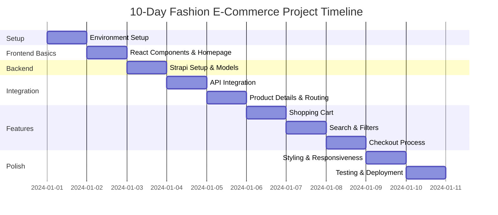
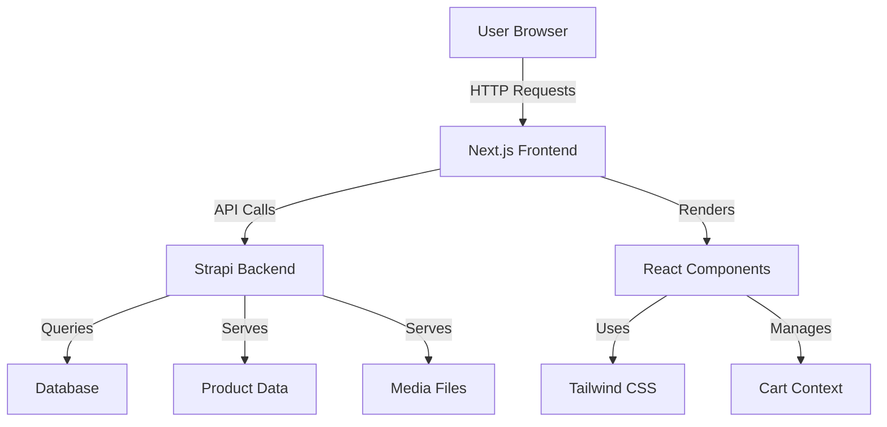
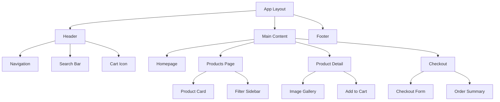
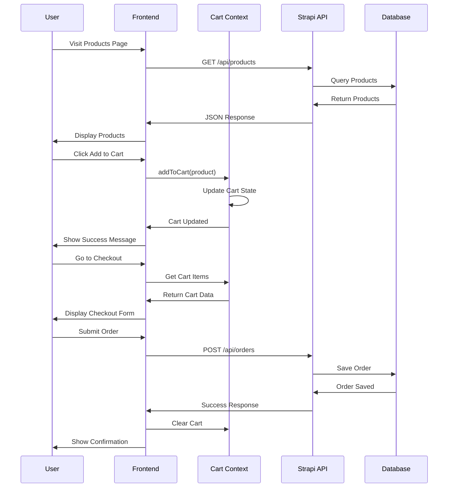

I have created the following plan after thorough exploration and analysis of the codebase. Follow the below plan verbatim. Trust the files and references. Do not re-verify what's written in the plan. Explore only when absolutely necessary. First implement all the proposed file changes and then I'll review all the changes together at the end.

# 10-Day Fashion E-Commerce Tutorial Plan for Students

## Overview

This is a fresh project workspace with no existing code. The plan creates a comprehensive 10-day educational curriculum for 14-year-old students to build a professional fashion e-commerce website. The approach uses Next.js for the frontend and Strapi for the backend, with JavaScript and React components. Each day is structured with clear learning objectives, hands-on tasks, AI prompts for assistance, and testing activities.

## Approach

The curriculum follows a progressive learning model, starting with foundational concepts and building complexity gradually. Days 1-3 focus on setup and basics, Days 4-6 on core features, Days 7-8 on advanced functionality, and Days 9-10 on polish and deployment. Each day includes theory (20%), practice (60%), and testing (20%) to ensure comprehension. AI prompts are provided to help students when stuck, making learning self-paced and supportive.

---

## Implementation Plan

### **Day 1: Introduction & Environment Setup**

#### Learning Objectives
- Understand what e-commerce websites are
- Learn about Next.js and Strapi
- Set up development environment

#### Tasks & Subtasks

**Task 1.1: Understanding the Project**
- Subtask 1.1.1: Watch introduction video about e-commerce websites
- Subtask 1.1.2: Explore 2-3 fashion websites (Zara, H&M) and note features
- Subtask 1.1.3: Create a simple sketch of your dream fashion store

**Task 1.2: Install Required Software**
- Subtask 1.2.1: Install Node.js (v18 or higher)
- Subtask 1.2.2: Install VS Code editor
- Subtask 1.2.3: Install Git for version control
- Subtask 1.2.4: Verify installations using terminal commands

**Task 1.3: Create Project Structure**
- Subtask 1.3.1: Create main project folder `fashion-store`
- Subtask 1.3.2: Initialize Next.js project using `npx create-next-app@latest frontend`
- Subtask 1.3.3: Initialize Strapi project using `npx create-strapi-app@latest backend`
- Subtask 1.3.4: Open both projects in VS Code

#### AI Prompts for Students
```
"Explain what Next.js is in simple terms for a 14-year-old"
"How do I check if Node.js is installed on my computer?"
"What is the difference between frontend and backend?"
"Help me troubleshoot: I'm getting an error when installing Next.js"
```

#### Tutorial Steps
1. Open terminal/command prompt
2. Navigate to your projects folder: `cd Desktop` (or wherever you want)
3. Create folder: `mkdir fashion-store && cd fashion-store`
4. Create frontend: `npx create-next-app@latest frontend --js --tailwind --app --no-src-dir`
5. Create backend: `npx create-strapi-app@latest backend --quickstart`
6. Wait for installations to complete (5-10 minutes)

#### Testing & Validation
- Run `node --version` - should show v18+
- Run `npm --version` - should show version number
- Start Next.js: `cd frontend && npm run dev` - should open localhost:3000
- Start Strapi: `cd backend && npm run develop` - should open localhost:1337

#### Homework
- Write 5 features you want in your fashion store
- Take screenshots of your favorite fashion website features

---

### **Day 2: Understanding React Components & Building Homepage**

#### Learning Objectives
- Learn what React components are
- Understand JSX syntax
- Create first homepage layout

#### Tasks & Subtasks

**Task 2.1: Learn React Basics**
- Subtask 2.1.1: Read about React components (15 minutes)
- Subtask 2.1.2: Understand props and state concepts
- Subtask 2.1.3: Practice creating a simple component

**Task 2.2: Create Homepage Structure**
- Subtask 2.2.1: Create `components` folder in frontend
- Subtask 2.2.2: Build `Header.jsx` component with logo and navigation
- Subtask 2.2.3: Build `Footer.jsx` component with links
- Subtask 2.2.4: Build `Hero.jsx` component for main banner
- Subtask 2.2.5: Update `app/page.js` to use these components

**Task 2.3: Style with Tailwind CSS**
- Subtask 2.3.1: Learn basic Tailwind classes (bg, text, p, m, flex)
- Subtask 2.3.2: Add colors and spacing to Header
- Subtask 2.3.3: Make Hero section attractive with background image
- Subtask 2.3.4: Style Footer with social media icons

#### AI Prompts for Students
```
"Explain React components like I'm 14 years old with an example"
"How do I create a navigation bar in React with Tailwind CSS?"
"Show me a simple Hero section code for a fashion website"
"What are props in React? Give me a simple example"
"Help me center a div using Tailwind CSS"
```

#### Tutorial Steps

**Creating Header Component:**
```
File: frontend/components/Header.jsx

1. Create the file in components folder
2. Write a function component called Header
3. Return JSX with nav, logo, and menu items
4. Use Tailwind classes: bg-white, shadow-md, flex, justify-between
5. Add menu items: Home, Shop, About, Contact
6. Export the component
```

**Creating Hero Section:**
```
File: frontend/components/Hero.jsx

1. Create function component Hero
2. Add a div with background image
3. Add heading "Welcome to Fashion Store"
4. Add subheading "Discover Your Style"
5. Add a "Shop Now" button
6. Use Tailwind: h-screen, bg-cover, flex, items-center, justify-center
```

#### Testing & Validation
- Homepage should display Header, Hero, and Footer
- Navigation links should be visible
- Hero section should be full-screen height
- All text should be readable
- No console errors in browser (F12 to check)

#### Homework
- Customize colors to match your fashion brand
- Find 3 free fashion images from Unsplash.com
- Write down 5 product categories (e.g., T-Shirts, Jeans, Shoes)

---

### **Day 3: Setting Up Strapi Backend & Creating Product Model**

#### Learning Objectives
- Understand what a CMS (Content Management System) is
- Learn about databases and data models
- Create product structure in Strapi

#### Tasks & Subtasks

**Task 3.1: Explore Strapi Admin Panel**
- Subtask 3.1.1: Start Strapi server
- Subtask 3.1.2: Create admin account (save credentials!)
- Subtask 3.1.3: Explore Content-Type Builder
- Subtask 3.1.4: Understand Collections vs Single Types

**Task 3.2: Create Product Content Type**
- Subtask 3.2.1: Click "Create new collection type"
- Subtask 3.2.2: Name it "Product"
- Subtask 3.2.3: Add fields: name (Text), description (Rich Text), price (Number)
- Subtask 3.2.4: Add fields: category (Text), image (Media), inStock (Boolean)
- Subtask 3.2.5: Save and restart Strapi

**Task 3.3: Create Category Content Type**
- Subtask 3.3.1: Create "Category" collection
- Subtask 3.3.2: Add fields: name (Text), description (Text), icon (Media)
- Subtask 3.3.3: Create relation: Category has many Products
- Subtask 3.3.4: Save and restart

**Task 3.4: Add Sample Products**
- Subtask 3.4.1: Add 5 fashion products manually
- Subtask 3.4.2: Upload product images
- Subtask 3.4.3: Set prices and descriptions
- Subtask 3.4.4: Publish all products

#### AI Prompts for Students
```
"What is a CMS and why do we need it for e-commerce?"
"Explain Strapi content types in simple words"
"What fields should a fashion product have in a database?"
"How do I create a relationship between two content types in Strapi?"
"Help me: I can't see my products in Strapi"
```

#### Tutorial Steps

**Creating Product Content Type:**
1. Open Strapi admin (localhost:1337/admin)
2. Go to Content-Type Builder (left sidebar)
3. Click "Create new collection type"
4. Display name: "Product"
5. Click "Continue"
6. Add fields one by one:
   - Text field: "name" (Short text, Required)
   - Rich text: "description" (Required)
   - Number: "price" (Decimal, Required)
   - Text: "category" (Short text)
   - Media: "image" (Single media, Required)
   - Boolean: "inStock" (Default: true)
7. Click "Finish" then "Save"
8. Wait for Strapi to restart

**Setting Permissions:**
1. Go to Settings → Roles → Public
2. Check "find" and "findOne" for Product
3. Check "find" and "findOne" for Category
4. Save

#### Testing & Validation
- Can access Strapi admin panel
- Product content type exists with all fields
- Can create a new product successfully
- Can upload images to products
- Can view products in Content Manager
- API endpoint works: `http://localhost:1337/api/products`

#### Homework
- Add 10 fashion products with real descriptions
- Create 3 categories: Men, Women, Accessories
- Find and upload quality product images

---

### **Day 4: Connecting Frontend to Backend (API Integration)**

#### Learning Objectives
- Understand APIs and how they work
- Learn to fetch data from Strapi
- Display products on the website

#### Tasks & Subtasks

**Task 4.1: Learn About APIs**
- Subtask 4.1.1: Understand what REST APIs are
- Subtask 4.1.2: Test Strapi API in browser
- Subtask 4.1.3: Learn about fetch() function in JavaScript
- Subtask 4.1.4: Understand async/await

**Task 4.2: Create API Service**
- Subtask 4.2.1: Create `lib` folder in frontend
- Subtask 4.2.2: Create `api.js` file for API calls
- Subtask 4.2.3: Write function to fetch all products
- Subtask 4.2.4: Write function to fetch single product
- Subtask 4.2.5: Handle errors properly

**Task 4.3: Create Products Page**
- Subtask 4.3.1: Create `app/products/page.js`
- Subtask 4.3.2: Fetch products using API service
- Subtask 4.3.3: Create `ProductCard.jsx` component
- Subtask 4.3.4: Display products in a grid layout
- Subtask 4.3.5: Show loading state while fetching

**Task 4.4: Style Product Cards**
- Subtask 4.4.1: Add product image
- Subtask 4.4.2: Display name, price, and category
- Subtask 4.4.3: Add "Add to Cart" button
- Subtask 4.4.4: Make cards responsive (mobile-friendly)

#### AI Prompts for Students
```
"Explain what an API is using a restaurant analogy"
"How do I fetch data from Strapi in Next.js?"
"Show me a simple fetch example with async/await"
"How do I display a loading spinner while data is loading?"
"Help me fix: CORS error when calling Strapi API"
"How do I make a grid of product cards responsive in Tailwind?"
```

#### Tutorial Steps

**Creating API Service:**
```
File: frontend/lib/api.js

1. Create the file
2. Define base URL: const API_URL = 'http://localhost:1337/api'
3. Create async function getAllProducts()
4. Use fetch() to call API_URL + '/products?populate=*'
5. Convert response to JSON
6. Return data
7. Add try-catch for error handling
8. Export functions
```

**Creating Product Card:**
```
File: frontend/components/ProductCard.jsx

1. Create component that accepts product as prop
2. Display product image using Next.js Image component
3. Show product name in heading
4. Display price with currency symbol
5. Show category badge
6. Add "Add to Cart" button
7. Style with Tailwind: rounded, shadow, hover effects
```

**Products Page:**
```
File: frontend/app/products/page.js

1. Import API service
2. Create async component
3. Fetch products using getAllProducts()
4. Map through products array
5. Render ProductCard for each product
6. Use grid layout: grid grid-cols-1 md:grid-cols-3 gap-6
```

#### Testing & Validation
- Products page loads without errors
- All products from Strapi are displayed
- Product images show correctly
- Prices are formatted properly
- Grid is responsive (test on mobile view)
- Loading state appears briefly
- No console errors

#### Homework
- Add a search bar above products (just UI, no functionality yet)
- Create a "Featured Products" section on homepage
- Add hover effects to product cards

---

### **Day 5: Product Details Page & Routing**

#### Learning Objectives
- Understand dynamic routing in Next.js
- Create individual product pages
- Learn about URL parameters

#### Tasks & Subtasks

**Task 5.1: Learn Next.js Routing**
- Subtask 5.1.1: Understand file-based routing
- Subtask 5.1.2: Learn about dynamic routes [id]
- Subtask 5.1.3: Understand useParams hook
- Subtask 5.1.4: Learn about Link component

**Task 5.2: Create Product Detail Page**
- Subtask 5.2.1: Create `app/products/[id]/page.js`
- Subtask 5.2.2: Fetch single product by ID
- Subtask 5.2.3: Display large product image
- Subtask 5.2.4: Show full description
- Subtask 5.2.5: Add quantity selector
- Subtask 5.2.6: Add "Add to Cart" button

**Task 5.3: Link Products to Detail Pages**
- Subtask 5.3.1: Import Link from next/link
- Subtask 5.3.2: Wrap ProductCard with Link
- Subtask 5.3.3: Set href to `/products/${product.id}`
- Subtask 5.3.4: Test navigation

**Task 5.4: Enhance Product Details**
- Subtask 5.4.1: Add breadcrumb navigation
- Subtask 5.4.2: Show "In Stock" / "Out of Stock" badge
- Subtask 5.4.3: Add size selector (S, M, L, XL)
- Subtask 5.4.4: Create image gallery (if multiple images)

#### AI Prompts for Students
```
"How does dynamic routing work in Next.js App Router?"
"Show me how to create a product detail page in Next.js"
"How do I get the ID from URL in Next.js 14?"
"How do I create a quantity selector in React?"
"Help me: Product detail page shows 404 error"
"How do I create a breadcrumb navigation?"
```

#### Tutorial Steps

**Creating Dynamic Route:**
```
File: frontend/app/products/[id]/page.js

1. Create folder structure: app/products/[id]/
2. Create page.js inside
3. Export async function with params
4. Extract id from params
5. Fetch product using id
6. Return JSX with product details
7. Handle case when product not found
```

**Product Detail Layout:**
```
Structure:
- Container with max-width
- Two-column layout (image left, details right)
- Image section: large product image
- Details section:
  - Product name (h1)
  - Price (large, bold)
  - Category badge
  - Description
  - Size selector (buttons)
  - Quantity selector (- button, number, + button)
  - Add to Cart button (large, prominent)
  - Stock status
```

**Linking Products:**
```
File: frontend/components/ProductCard.jsx

1. Import Link from 'next/link'
2. Wrap entire card content with Link
3. Set href={`/products/${product.id}`}
4. Remove default link styling
5. Add hover effect to card
```

#### Testing & Validation
- Clicking product card navigates to detail page
- Product details load correctly
- Images display properly
- Quantity selector increases/decreases
- Size buttons are clickable
- Back navigation works
- URL shows correct product ID
- 404 page shows for invalid IDs

#### Homework
- Add "Related Products" section at bottom
- Create a "Back to Products" button
- Add social share buttons (just UI)

---

### **Day 6: Shopping Cart Functionality**

#### Learning Objectives
- Understand state management in React
- Learn about Context API
- Implement shopping cart logic

#### Tasks & Subtasks

**Task 6.1: Learn State Management**
- Subtask 6.1.1: Understand React Context API
- Subtask 6.1.2: Learn about global state vs local state
- Subtask 6.1.3: Understand useContext and useReducer hooks

**Task 6.2: Create Cart Context**
- Subtask 6.2.1: Create `context` folder in frontend
- Subtask 6.2.2: Create `CartContext.js`
- Subtask 6.2.3: Define cart state (items array)
- Subtask 6.2.4: Create addToCart function
- Subtask 6.2.5: Create removeFromCart function
- Subtask 6.2.6: Create updateQuantity function
- Subtask 6.2.7: Wrap app with CartProvider

**Task 6.3: Build Cart Component**
- Subtask 6.3.1: Create `components/Cart.jsx`
- Subtask 6.3.2: Display cart items list
- Subtask 6.3.3: Show item image, name, price, quantity
- Subtask 6.3.4: Add remove button for each item
- Subtask 6.3.5: Calculate and display subtotal
- Subtask 6.3.6: Add "Checkout" button

**Task 6.4: Add Cart to Header**
- Subtask 6.4.1: Add cart icon to Header
- Subtask 6.4.2: Show cart item count badge
- Subtask 6.4.3: Create cart dropdown/sidebar
- Subtask 6.4.4: Toggle cart visibility on click

**Task 6.5: Connect Add to Cart Buttons**
- Subtask 6.5.1: Use CartContext in ProductCard
- Subtask 6.5.2: Use CartContext in Product Detail page
- Subtask 6.5.3: Call addToCart on button click
- Subtask 6.5.4: Show success message/animation

#### AI Prompts for Students
```
"Explain React Context API like I'm 14"
"How do I create a shopping cart context in React?"
"Show me how to add items to cart in React"
"How do I calculate total price of cart items?"
"Help me: Cart items disappear when I refresh the page"
"How do I create a cart icon with item count badge?"
"How do I save cart to localStorage?"
```

#### Tutorial Steps

**Creating Cart Context:**
```
File: frontend/context/CartContext.js

1. Import createContext, useState, useContext
2. Create CartContext
3. Create CartProvider component
4. Initialize state: const [cart, setCart] = useState([])
5. Create addToCart function:
   - Check if item exists
   - If yes, increase quantity
   - If no, add new item
6. Create removeFromCart function
7. Create clearCart function
8. Calculate total items and total price
9. Provide value to context
10. Export CartProvider and useCart hook
```

**Wrapping App:**
```
File: frontend/app/layout.js

1. Import CartProvider
2. Wrap {children} with <CartProvider>
3. Ensure it's inside body tag
```

**Cart Component:**
```
File: frontend/components/Cart.jsx

1. Use useCart hook to get cart items
2. Map through items
3. Display each item with image, name, price
4. Add quantity controls
5. Add remove button
6. Calculate subtotal
7. Show empty cart message if no items
8. Style as sidebar or modal
```

#### Testing & Validation
- Add to Cart button adds items to cart
- Cart icon shows correct item count
- Cart displays all added items
- Quantity can be updated
- Items can be removed
- Total price calculates correctly
- Cart persists on page navigation
- Empty cart shows appropriate message

#### Homework
- Add animation when item is added to cart
- Save cart to localStorage (so it persists on refresh)
- Add "Continue Shopping" button in cart

---

### **Day 7: Search & Filter Functionality**

#### Learning Objectives
- Implement search functionality
- Create category filters
- Learn about array methods (filter, map)

#### Tasks & Subtasks

**Task 7.1: Create Search Bar**
- Subtask 7.1.1: Create `SearchBar.jsx` component
- Subtask 7.1.2: Add input field with icon
- Subtask 7.1.3: Handle input changes
- Subtask 7.1.4: Add search button
- Subtask 7.1.5: Place in Header component

**Task 7.2: Implement Search Logic**
- Subtask 7.2.1: Create search state
- Subtask 7.2.2: Filter products by search term
- Subtask 7.2.3: Search in product name and description
- Subtask 7.2.4: Update products display
- Subtask 7.2.5: Show "No results" message

**Task 7.3: Create Category Filter**
- Subtask 7.3.1: Create `FilterSidebar.jsx` component
- Subtask 7.3.2: Fetch categories from Strapi
- Subtask 7.3.3: Display category checkboxes
- Subtask 7.3.4: Handle category selection
- Subtask 7.3.5: Filter products by selected categories

**Task 7.4: Add Price Range Filter**
- Subtask 7.4.1: Create price range slider
- Subtask 7.4.2: Set min and max price
- Subtask 7.4.3: Filter products by price range
- Subtask 7.4.4: Display current range values

**Task 7.5: Combine Filters**
- Subtask 7.5.1: Apply search + category + price filters together
- Subtask 7.5.2: Add "Clear Filters" button
- Subtask 7.5.3: Show active filter count
- Subtask 7.5.4: Make filters responsive (mobile)

#### AI Prompts for Students
```
"How do I create a search bar in React?"
"Show me how to filter an array of products by name"
"How do I create checkboxes for categories in React?"
"How do I filter products by multiple criteria?"
"Help me: Search is not working properly"
"How do I create a price range slider in React?"
"How do I make filters work on mobile?"
```

#### Tutorial Steps

**Search Bar Component:**
```
File: frontend/components/SearchBar.jsx

1. Create component with input field
2. Add state for search term
3. Handle onChange event
4. Pass search term to parent component
5. Style with Tailwind: rounded, border, padding
6. Add search icon (use emoji 🔍 or icon library)
```

**Search Logic:**
```
File: frontend/app/products/page.js

1. Add search state
2. Create filtered products variable
3. Use filter() method on products array
4. Check if product.name includes search term
5. Use toLowerCase() for case-insensitive search
6. Display filtered products instead of all products
```

**Filter Sidebar:**
```
File: frontend/components/FilterSidebar.jsx

1. Create sidebar component
2. Add "Categories" section
3. Map through categories
4. Create checkbox for each
5. Add "Price Range" section
6. Add min/max inputs or slider
7. Add "Apply Filters" button
8. Style with Tailwind
```

**Combining Filters:**
```
Logic:
1. Start with all products
2. Apply search filter first
3. Then apply category filter
4. Then apply price filter
5. Return final filtered array
6. Display count: "Showing X products"
```

#### Testing & Validation
- Search bar filters products in real-time
- Category checkboxes filter correctly
- Multiple categories can be selected
- Price range filter works
- All filters work together
- Clear filters resets everything
- "No results" shows when appropriate
- Filters are responsive on mobile

#### Homework
- Add sort options (Price: Low to High, High to Low)
- Add "In Stock Only" checkbox
- Create a "Popular" filter

---

### **Day 8: Checkout Page & Form Handling**

#### Learning Objectives
- Create forms in React
- Handle form validation
- Build checkout process

#### Tasks & Subtasks

**Task 8.1: Create Checkout Page**
- Subtask 8.1.1: Create `app/checkout/page.js`
- Subtask 8.1.2: Display cart summary
- Subtask 8.1.3: Show total price
- Subtask 8.1.4: Create checkout form layout

**Task 8.2: Build Checkout Form**
- Subtask 8.2.1: Add customer information fields (name, email, phone)
- Subtask 8.2.2: Add shipping address fields (address, city, postal code, country)
- Subtask 8.2.3: Add payment method selection (Cash on Delivery, Card)
- Subtask 8.2.4: Style form with Tailwind

**Task 8.3: Form Validation**
- Subtask 8.3.1: Add required field validation
- Subtask 8.3.2: Validate email format
- Subtask 8.3.3: Validate phone number
- Subtask 8.3.4: Show error messages
- Subtask 8.3.5: Disable submit if form invalid

**Task 8.4: Order Summary Component**
- Subtask 8.4.1: Create `OrderSummary.jsx`
- Subtask 8.4.2: Display cart items
- Subtask 8.4.3: Show subtotal, shipping, tax
- Subtask 8.4.4: Calculate and show total
- Subtask 8.4.5: Add promo code input (UI only)

**Task 8.5: Place Order Functionality**
- Subtask 8.5.1: Create order submission handler
- Subtask 8.5.2: Collect form data
- Subtask 8.5.3: Create order object
- Subtask 8.5.4: Show success message
- Subtask 8.5.5: Clear cart after order
- Subtask 8.5.6: Redirect to thank you page

#### AI Prompts for Students
```
"How do I create a form in React with validation?"
"Show me how to validate email in JavaScript"
"How do I handle form submission in React?"
"How do I create a checkout page layout?"
"Help me: Form validation is not working"
"How do I calculate shipping cost based on location?"
"How do I show error messages under form fields?"
```

#### Tutorial Steps

**Checkout Page Structure:**
```
File: frontend/app/checkout/page.js

Layout:
- Two columns (desktop)
- Left: Checkout form
- Right: Order summary
- Mobile: Stack vertically

Form sections:
1. Contact Information
2. Shipping Address
3. Payment Method
4. Place Order button
```

**Form Validation:**
```
Steps:
1. Create state for form data
2. Create state for errors
3. Create validation function
4. Check each field:
   - Name: not empty, min 2 characters
   - Email: valid email format
   - Phone: numbers only, 10 digits
   - Address: not empty
5. Set error messages
6. Return true/false
7. Call validation on submit
```

**Order Summary:**
```
File: frontend/components/OrderSummary.jsx

Display:
- List of cart items (name, qty, price)
- Subtotal
- Shipping: $10 (or free if > $100)
- Tax: 10% of subtotal
- Total (bold, large)
- Promo code input
- Sticky on scroll (desktop)
```

**Place Order Handler:**
```
Steps:
1. Prevent default form submission
2. Validate form
3. If invalid, show errors and return
4. If valid, create order object
5. Log order to console (for now)
6. Show success alert
7. Clear cart
8. Navigate to /thank-you page
```

#### Testing & Validation
- Checkout page displays cart items
- All form fields are present
- Validation works for each field
- Error messages show correctly
- Can't submit with invalid data
- Order summary calculates correctly
- Shipping cost applies properly
- Tax calculates correctly
- Success message appears
- Cart clears after order
- Redirects to thank you page

#### Homework
- Create a "Thank You" page with order confirmation
- Add a "Back to Cart" button
- Create a progress indicator (Cart → Checkout → Confirmation)

---

### **Day 9: Styling, Animations & Mobile Responsiveness**

#### Learning Objectives
- Make website fully responsive
- Add animations and transitions
- Improve user experience

#### Tasks & Subtasks

**Task 9.1: Mobile Responsiveness Audit**
- Subtask 9.1.1: Test all pages on mobile view
- Subtask 9.1.2: List issues and broken layouts
- Subtask 9.1.3: Fix Header for mobile (hamburger menu)
- Subtask 9.1.4: Fix product grid for mobile
- Subtask 9.1.5: Fix checkout form for mobile

**Task 9.2: Create Mobile Navigation**
- Subtask 9.2.1: Create hamburger menu icon
- Subtask 9.2.2: Create mobile menu sidebar
- Subtask 9.2.3: Add open/close animation
- Subtask 9.2.4: Make menu items clickable
- Subtask 9.2.5: Close menu on navigation

**Task 9.3: Add Animations**
- Subtask 9.3.1: Add fade-in animation to products
- Subtask 9.3.2: Add hover effects to buttons
- Subtask 9.3.3: Add slide-in animation to cart
- Subtask 9.3.4: Add loading spinner
- Subtask 9.3.5: Add success checkmark animation

**Task 9.4: Improve Visual Design**
- Subtask 9.4.1: Choose consistent color scheme
- Subtask 9.4.2: Update all buttons to match
- Subtask 9.4.3: Add shadows and borders
- Subtask 9.4.4: Improve typography (fonts, sizes)
- Subtask 9.4.5: Add icons throughout site

**Task 9.5: Performance Optimization**
- Subtask 9.5.1: Optimize images (use Next.js Image)
- Subtask 9.5.2: Add loading states
- Subtask 9.5.3: Lazy load components
- Subtask 9.5.4: Test page load speed

#### AI Prompts for Students
```
"How do I make a website responsive in Tailwind CSS?"
"Show me how to create a hamburger menu in React"
"How do I add fade-in animations with Tailwind?"
"How do I optimize images in Next.js?"
"Help me: Website looks broken on mobile"
"How do I create a loading spinner in React?"
"What are good color schemes for a fashion website?"
```

#### Tutorial Steps

**Mobile Navigation:**
```
File: frontend/components/Header.jsx

1. Add state for menu open/close
2. Create hamburger icon (3 lines)
3. Show hamburger on mobile, hide on desktop
4. Create mobile menu component
5. Position fixed, full height
6. Slide in from left
7. Add close button
8. List menu items vertically
9. Add transition classes
```

**Responsive Breakpoints:**
```
Tailwind breakpoints to use:
- sm: 640px (mobile)
- md: 768px (tablet)
- lg: 1024px (desktop)
- xl: 1280px (large desktop)

Apply:
- Product grid: grid-cols-1 sm:grid-cols-2 lg:grid-cols-3 xl:grid-cols-4
- Padding: px-4 md:px-8 lg:px-16
- Text sizes: text-sm md:text-base lg:text-lg
- Hide/show: hidden md:block
```

**Animations:**
```
Using Tailwind:
- Fade in: animate-fade-in (custom)
- Slide in: transition-transform duration-300
- Hover: hover:scale-105 transition-transform
- Button: hover:bg-blue-600 transition-colors

Create custom animations in tailwind.config.js:
- fadeIn
- slideIn
- bounce
```

**Color Scheme:**
```
Choose a palette:
- Primary: #2563eb (blue)
- Secondary: #7c3aed (purple)
- Accent: #f59e0b (orange)
- Background: #f9fafb (light gray)
- Text: #1f2937 (dark gray)

Apply consistently:
- Buttons: bg-primary hover:bg-primary-dark
- Links: text-primary
- Headings: text-gray-900
- Body: text-gray-700
```

#### Testing & Validation
- Test on mobile (375px width)
- Test on tablet (768px width)
- Test on desktop (1920px width)
- All pages are responsive
- No horizontal scroll
- Text is readable on all devices
- Buttons are tappable (min 44px)
- Images load properly
- Animations are smooth
- No layout shifts

#### Homework
- Add a "Back to Top" button
- Create a 404 error page
- Add a loading screen for the entire site

---

### **Day 10: Testing, Bug Fixes & Deployment**

#### Learning Objectives
- Learn to test websites
- Fix bugs and issues
- Deploy website online

#### Tasks & Subtasks

**Task 10.1: Comprehensive Testing**
- Subtask 10.1.1: Create testing checklist
- Subtask 10.1.2: Test all pages and features
- Subtask 10.1.3: Test on different browsers
- Subtask 10.1.4: Test on different devices
- Subtask 10.1.5: Document all bugs found

**Task 10.2: Bug Fixing**
- Subtask 10.2.1: Prioritize bugs (critical, major, minor)
- Subtask 10.2.2: Fix critical bugs first
- Subtask 10.2.3: Fix major bugs
- Subtask 10.2.4: Fix minor bugs if time permits
- Subtask 10.2.5: Re-test after fixes

**Task 10.3: Final Polish**
- Subtask 10.3.1: Add favicon
- Subtask 10.3.2: Update page titles and meta descriptions
- Subtask 10.3.3: Add Open Graph images
- Subtask 10.3.4: Check all links work
- Subtask 10.3.5: Spell check all content

**Task 10.4: Prepare for Deployment**
- Subtask 10.4.1: Create production build
- Subtask 10.4.2: Test production build locally
- Subtask 10.4.3: Set up environment variables
- Subtask 10.4.4: Prepare deployment checklist

**Task 10.5: Deploy Website**
- Subtask 10.5.1: Deploy Strapi to Railway/Render
- Subtask 10.5.2: Deploy Next.js to Vercel
- Subtask 10.5.3: Connect frontend to deployed backend
- Subtask 10.5.4: Test live website
- Subtask 10.5.5: Share website link

**Task 10.6: Documentation**
- Subtask 10.6.1: Write README.md file
- Subtask 10.6.2: Document how to run project
- Subtask 10.6.3: List features implemented
- Subtask 10.6.4: Add screenshots
- Subtask 10.6.5: Create presentation for demo

#### AI Prompts for Students
```
"What should I test on an e-commerce website?"
"How do I deploy Next.js to Vercel?"
"How do I deploy Strapi backend?"
"Help me: Website works locally but not after deployment"
"How do I add a favicon to Next.js?"
"How do I write a good README for my project?"
"What are environment variables and how do I use them?"
```

#### Tutorial Steps

**Testing Checklist:**
```
Homepage:
☐ Header displays correctly
☐ Hero section loads
☐ Featured products show
☐ Footer displays
☐ All links work

Products Page:
☐ All products load
☐ Images display
☐ Search works
☐ Filters work
☐ Pagination works (if added)

Product Detail:
☐ Product loads
☐ Image displays
☐ Add to cart works
☐ Quantity selector works

Cart:
☐ Items display
☐ Quantity updates
☐ Remove works
☐ Total calculates
☐ Checkout button works

Checkout:
☐ Form displays
☐ Validation works
☐ Order submits
☐ Success message shows

Mobile:
☐ All pages responsive
☐ Menu works
☐ Touch interactions work
```

**Deploying to Vercel:**
```
Steps:
1. Create account on vercel.com
2. Install Vercel CLI: npm i -g vercel
3. Navigate to frontend folder
4. Run: vercel
5. Follow prompts
6. Choose project name
7. Wait for deployment
8. Get deployment URL
9. Test live site
```

**Deploying Strapi:**
```
Options:
1. Railway.app (recommended for students)
2. Render.com
3. Heroku

Steps for Railway:
1. Create account on railway.app
2. Create new project
3. Deploy from GitHub
4. Select backend folder
5. Add PostgreSQL database
6. Set environment variables
7. Deploy
8. Get API URL
9. Update frontend API_URL
```

**Environment Variables:**
```
Frontend (.env.local):
NEXT_PUBLIC_API_URL=https://your-strapi-url.com/api

Backend (.env):
DATABASE_URL=your-database-url
JWT_SECRET=your-secret-key
```

**README Template:**
```markdown
# Fashion Store E-Commerce Website

## Description
A modern fashion e-commerce website built with Next.js and Strapi.

## Features
- Product catalog
- Search and filters
- Shopping cart
- Checkout process
- Responsive design

## Technologies
- Next.js 14
- React
- Strapi CMS
- Tailwind CSS

## How to Run
1. Clone repository
2. Install dependencies: npm install
3. Run frontend: cd frontend && npm run dev
4. Run backend: cd backend && npm run develop

## Screenshots
[Add screenshots here]

## Live Demo
[Add link here]

## Created By
[Your name]
```

#### Testing & Validation
- All features work as expected
- No console errors
- Website is responsive
- All links work
- Forms validate properly
- Images load correctly
- Website is deployed successfully
- Live URL is accessible
- Backend API is connected
- README is complete

#### Final Presentation
- Prepare 5-minute demo
- Show homepage
- Demonstrate search and filters
- Add product to cart
- Complete checkout process
- Show mobile responsiveness
- Share live link

---

## Additional Resources for Students

### Helpful Websites
- **Next.js Documentation**: nextjs.org/docs
- **Strapi Documentation**: docs.strapi.io
- **Tailwind CSS**: tailwindcss.com/docs
- **React Documentation**: react.dev
- **Free Images**: unsplash.com, pexels.com
- **Icons**: heroicons.com, fontawesome.com
- **Color Palettes**: coolors.co

### Video Tutorials (Recommended)
- "Next.js for Beginners" on YouTube
- "React Crash Course" on YouTube
- "Tailwind CSS Tutorial" on YouTube
- "Strapi Headless CMS Tutorial" on YouTube

### AI Prompts for General Help
```
"Explain [concept] in simple terms for a beginner"
"Show me an example of [feature] in React"
"How do I fix this error: [error message]"
"What is the best way to [task] in Next.js?"
"Help me debug: [describe problem]"
"Give me step-by-step instructions to [task]"
```

### Daily Time Breakdown
- **Theory/Learning**: 30-45 minutes
- **Hands-on Coding**: 2-3 hours
- **Testing**: 30 minutes
- **Homework**: 30-60 minutes
- **Total**: 4-5 hours per day

### Tips for Success
1. **Don't skip days** - Each day builds on the previous
2. **Ask for help** - Use AI prompts when stuck
3. **Test frequently** - Don't wait until the end
4. **Take breaks** - Code for 45 min, break for 15 min
5. **Save your work** - Commit to Git daily
6. **Have fun** - Experiment and be creative!

### Common Errors & Solutions

| Error | Solution |
|-------|----------|
| "Module not found" | Run `npm install` |
| "Port already in use" | Kill process or use different port |
| "CORS error" | Check Strapi permissions |
| "Cannot read property of undefined" | Check if data exists before accessing |
| "Hydration error" | Ensure server and client render same content |
| "Image not loading" | Check image path and format |

---

## Project Evaluation Rubric

### Functionality (40 points)
- Homepage with products: 10 points
- Product detail pages: 10 points
- Shopping cart: 10 points
- Search and filters: 5 points
- Checkout form: 5 points

### Design (30 points)
- Visual appeal: 10 points
- Responsive design: 10 points
- Consistent styling: 5 points
- User experience: 5 points

### Code Quality (20 points)
- Clean code: 5 points
- Proper component structure: 5 points
- No console errors: 5 points
- Comments and documentation: 5 points

### Deployment (10 points)
- Successfully deployed: 5 points
- Working live URL: 5 points

**Total: 100 points**

---

## Bonus Challenges (Optional)

For students who finish early or want extra credit:

1. **User Authentication** - Add login/signup functionality
2. **Wishlist** - Allow users to save favorite products
3. **Product Reviews** - Let users rate and review products
4. **Order History** - Show past orders (requires backend)
5. **Email Notifications** - Send order confirmation emails
6. **Payment Integration** - Add Stripe payment gateway
7. **Admin Dashboard** - Create custom admin panel
8. **Multi-language** - Add language switcher
9. **Dark Mode** - Implement dark/light theme toggle
10. **PWA** - Make it a Progressive Web App

---

## Project Timeline Visualization



---

## Architecture Overview



---

## Component Structure



---

## Data Flow



---

## Success Criteria

By the end of Day 10, students should have:

✅ A fully functional fashion e-commerce website  
✅ Product catalog with images and details  
✅ Working search and filter functionality  
✅ Functional shopping cart  
✅ Complete checkout process  
✅ Responsive design for all devices  
✅ Deployed live website  
✅ Complete documentation  
✅ Understanding of React, Next.js, and Strapi  
✅ Confidence to build similar projects  

---

## Teacher Notes

### Preparation Before Day 1
- Ensure all students have computers with internet
- Pre-install Node.js on all machines if possible
- Create a class Discord/Slack for questions
- Prepare backup USB drives with installers
- Have example projects ready to show

### Daily Monitoring
- Start each day with 10-minute recap
- Check student progress every hour
- Pair struggling students with advanced ones
- End each day with 10-minute Q&A

### Common Student Struggles
- **Day 1-2**: Installation issues, terminal commands
- **Day 3-4**: Understanding APIs and async/await
- **Day 5-6**: State management and Context API
- **Day 7-8**: Form validation and complex logic
- **Day 9-10**: Deployment and environment variables

### Adaptation Tips
- If students are ahead: Add bonus challenges
- If students are behind: Simplify features, focus on core functionality
- For mixed skill levels: Create "helper" and "learner" pairs
- For remote learning: Record daily sessions, use screen sharing

### Assessment Methods
- Daily check-ins (informal)
- Mid-project review (Day 5)
- Final project submission (Day 10)
- Peer code review (Day 10)
- Presentation/demo (Day 10)

---

## Parent/Guardian Information

### What Your Child Will Learn
- Web development fundamentals
- Programming in JavaScript
- Problem-solving skills
- Project management
- Teamwork and collaboration

### How to Support at Home
- Ensure quiet workspace
- Provide reliable internet
- Encourage daily practice
- Celebrate small wins
- Don't worry if you don't understand the code!

### Time Commitment
- 4-5 hours per day for 10 days
- Best done consecutively (not spread over weeks)
- Can be done during school break or summer

### Career Relevance
- Web development is in high demand
- Average web developer salary: $75,000+
- Skills applicable to many tech careers
- Great foundation for computer science

---

## Conclusion

This 10-day tutorial is designed to be **achievable, educational, and fun** for 14-year-old students. The project progresses logically from setup to deployment, with each day building on the previous. Students will gain practical experience with modern web technologies and have a portfolio project to showcase.

**Remember**: The goal is learning, not perfection. Encourage experimentation, celebrate mistakes as learning opportunities, and most importantly, have fun building!

Good luck! 🚀👕👗